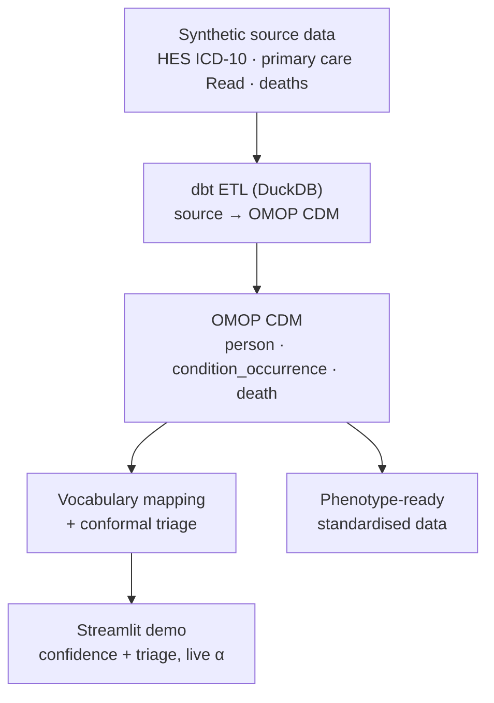

# Concordance

**Uncertainty-calibrated mapping of source clinical codes to standard OMOP (SNOMED) concepts.**


Concordance takes clinical codes as they arrive in linked health records, ICD-10 from hospital data, Read v2 from primary care — standardises them into an OMOP
Common Data Model, and attaches a **calibrated confidence** and a **conformal triage decision** to every proposed mapping. Instead of silently auto-accepting a
best-guess match (the usual failure mode) or sending every code to a human, it
routes only the genuinely ambiguous codes to review, with a distribution-free
guarantee on how often the correct concept is retained.

> **Data note.** All data here is **synthetic**. Patients are generated with a
> Synthea-style process; the vocabulary is a small curated OMOP-shaped subset, not
> the full Athena download. Nothing in this repository uses real patient data. The
> source tables are deliberately shaped like UK Biobank's *linked* structure (HES /
> primary care / death registry, each with its own coding system) so the pipeline
> demonstrates the real harmonisation problem. Swapping in the full Athena
> vocabulary or a real Synthea run is a drop-in change — the table shapes match.

---

## Why this exists

Standardising source codes into OMOP is a mapping problem: for each source term,
pick the right standard SNOMED concept from thousands of candidates. OHDSI's Usagi
ranks candidates by string similarity and hands **everything** to a human curator.
That's slow, and the accept/reject boundary is an un-calibrated judgement call.

Concordance keeps the same similarity backbone but adds a **split conformal
prediction** layer on top. For a chosen error rate α, it produces a *prediction
set* of plausible concepts per code with a guarantee that the true concept is in
the set with probability ≥ 1 − α. The set size then drives triage:

| conformal set | meaning | action |
|---|---|---|
| exactly 1 concept | one confident candidate | **auto-accept** |
| 2 or more | genuinely ambiguous | **route to human review** |
| empty | nothing clears the bar | **flag as no-match / out-of-distribution** |

The result: mapping errors are *concentrated into the review queue* instead of
silently entering the CDM, and the human only looks at the codes that actually
need a human.

## Architecture



- **ETL** - `dbt-duckdb` models transform linked source tables into an OMOP CDM,
  standardising ICD-10 and Read codes via the vocabulary's `Maps to` relationships.
- **Mapping** - `src/concordance/` fits a character n-gram TF-IDF similarity model,
  turns similarities into probabilities, calibrates a conformal threshold, and
  triages each code.
- **Demo** - a Streamlit app with a live α slider showing the coverage / effort
  tradeoff.

## Results (synthetic vocabulary, 60 source codes → 30 standard concepts)

Averaged over 300 random calibration/test splits, empirical coverage tracks the
target and stays at or above the 1 − α guarantee:

| α | target coverage | empirical coverage | avg set size |
|---|---|---|---|
| 0.20 | 80% | 82.9% | 0.84 |
| 0.15 | 85% | 91.0% | 0.95 |
| 0.10 | 90% | 94.1% | 1.03 |
| 0.05 | 95% | 97.3% | 1.16 |

At α = 0.10 on a held-out split: a naive "auto-accept top-1" strategy reaches
**90%** accuracy - meaning ~10% of codes enter the CDM as *silent* errors. With
conformal triage, ~**90%** of codes are auto-accepted at **96%** accuracy, and the
remaining codes are surfaced for review or flagged as no-match rather than
mismapped silently.

(Numbers are reproducible: `make map` writes `outputs/metrics.json`.)

## Quickstart

```bash
pip install -r requirements.txt   # or: make setup

make data    # build synthetic vocabulary + UKB-shaped source data
make etl     # dbt: source → OMOP CDM in outputs/omop.duckdb
make map     # run mapping + conformal triage → outputs/
make test    # run the test suite
make app     # launch the interactive demo
```

Or run the whole build: `make all`.

## Repository layout

```
concordance/
├── data/
│   ├── build_vocabulary.py     curated OMOP-shaped demo vocabulary
│   └── generate_source.py      synthetic UKB-shaped linked EHR
├── dbt/                        dbt-duckdb OMOP ETL
│   └── models/{staging,omop}/
├── src/concordance/
│   ├── similarity.py           TF-IDF char n-gram backbone
│   ├── mapper.py               source term → probability over candidates
│   ├── conformal.py            split conformal prediction + triage
│   └── evaluate.py             coverage / efficiency / triage metrics
├── scripts/run_mapping.py      end-to-end mapping pipeline
├── app/streamlit_app.py        interactive demo
└── tests/                      conformal coverage, triage, mapper, data
```

## How the conformal layer works

Given a classifier that outputs `p(concept | source_term)`:

1. On a **calibration** set of known mappings, compute nonconformity scores
   `s = 1 − p(true_concept | term)`.
2. Set `q̂` to the finite-sample-corrected `(1 − α)` quantile of those scores.
3. For a new code, the prediction set is every concept with `1 − p ≤ q̂`.

Under exchangeability this gives marginal coverage ≥ 1 − α with no distributional
assumptions (Vovk et al. 2005; Angelopoulos & Bates 2021). The method is
model-agnostic — the TF-IDF backbone can be replaced with dense biomedical
embeddings without touching the calibration or triage code.

## Roadmap

- Swap the curated vocabulary for the full OMOP/Athena download.
- Add OHDSI `Achilles` + `DataQualityDashboard` reports over the built CDM.
- Add uncertainty-aware phenotyping (calibrated cohort membership).
- Dense biomedical sentence embeddings as an alternative backbone.

## Licence

MIT. Synthetic data only; not for clinical use.
